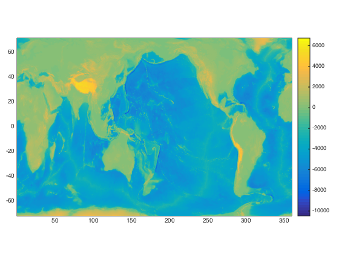
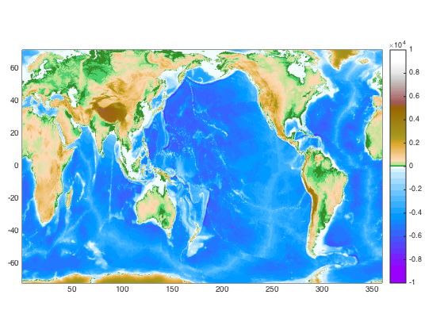
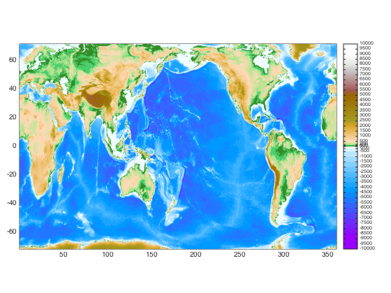

## cptcmap.m Documentation

This function creates and applies a colormap defined in a color palette table (.cpt file). Color palette files provide more flexible colormapping than Matlab's default schemes, including both discrete and continuous gradients, as well as easier direct color mapping.

For a full description of the cpt file format, see the Generic Mapping Tools documentation (http://gmt.soest.hawaii.edu/). 

This package includes 20 standard GMT colormaps; please see the header of each file for copyright information.   Many more color tables are available on the cpt-city website (http://soliton.vm.bytemark.co.uk/pub/cpt-city/index.html).
 
### Syntax

```
cptcmap(name);
cptcmap(name, ax);
cptcmap(... param, val, ...);
[cmap, lims, ticks, bfncol, ctable] = cptcmap(...)

h = cptcbar(ax, map, loc, flag)
```

See function help for full description of input and output variables

### Example

We'll start with a simple pcolor plot of topography.

```matlab
[lat, lon, z] = satbath(10);

axes('position', [0.05 0.15 0.9 0.7]);
pcolor(lon, lat, z);
shading flat;

cb = colorbar;
```


 Apply the GMT_globe.cpt color palette table.  The color limits of this
 table are set to match global topography, so we'll use direct mapping
 here.

```matlab
cptcmap('GMT_globe', 'mapping', 'direct');
```



 If you want to label the specific color intervals used in the colormap,
 replace the colorbar with a cptcbar (which mimics a colorbar).

```matlab
delete(cb);
cb = cptcbar(gca, 'GMT_globe', 'eastoutside', false);
set(cb.ax, 'fontsize', 7);
```


 Sometimes, it's useful to show even color intervals on the colorbar, even
 if the tick values are unevenly spaced.  In this example, the near-sea-level tick labels get too squished to read.  Use the last input of cptcbar to change this.

```matlab
delete(cb.ax);
cb = cptcbar(gca, 'GMT_globe', 'eastoutside', true);
set(cb.ax, 'fontsize', 7);
```
